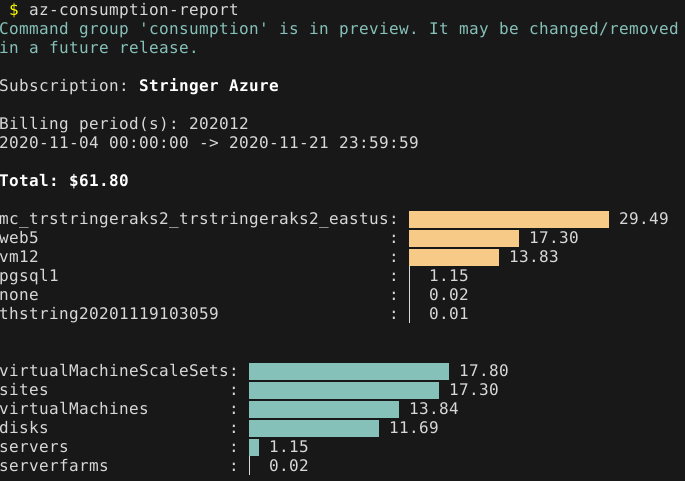

# az-consumption-summary

Show a consumption report in your terminal for your Azure subscription.



## Requirements

* Python 3
* Bash
* Azure CLI
* [termgraph](https://github.com/mkaz/termgraph)
* make

## Installation

Clone this repo and then run `make install-report`.

## Usage

The main report can be displayed in your terminal by running:

```
$ az-consumption-report
```

**Note: This uses the currently logged in Azure CLI credentials and subscription.**

All this script does is run `az consumption usage list` and then pipes that to `az-consumption-summary`:

```
$ az-consumption-summary --help
Usage: az_consumption_summary.py [OPTIONS] COMMAND [ARGS]...

  `az consumption usage list` summarizer

Options:
  --help  Show this message and exit.

Commands:
  costs     Cost summary grouping from consumption
  timeline  Billing period and timing summary
  total     Get the total cost of all input data
```

The output of these three commands is formatted explicitly for termgraph.

## Windows support

This was developed and tested on Linux (it should work with macOS, but please open an issue if that isn't the case). If you are interested in running this on Windows then you should be able to in WSL.
